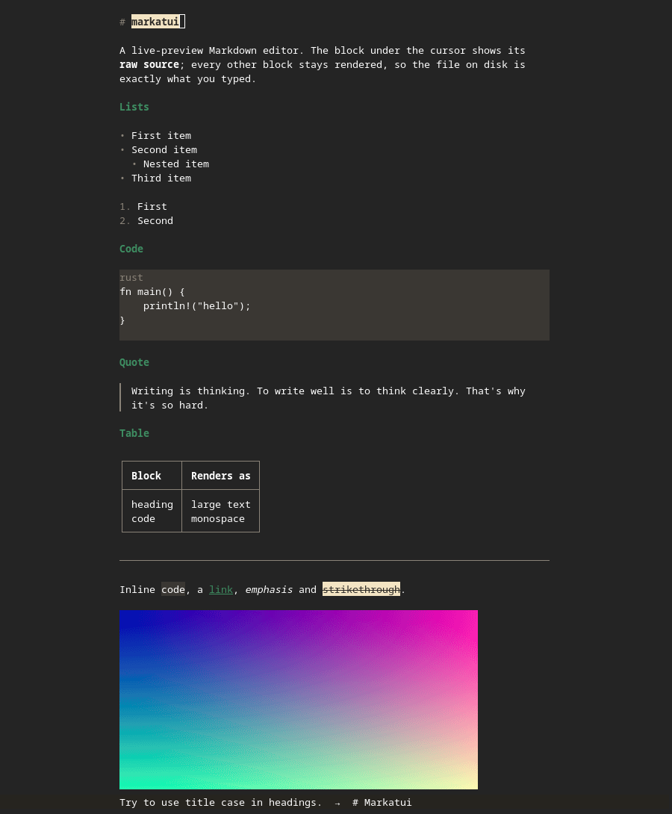

# markatui

A Markdown editor for the terminal. Markdown is rendered whilst typing. Keyboard-first with configurable keymap with defaults that work like traditional editors (unlike vim).

Mostly WYSIWYG - the block under the cursor is shown as raw Markdown in some cases. Renders images if the terminal supports it.



This is based off [blogawrite](https://github.com/ilia-iliev/blogawrite) - similar concept, but a standalone editor.

## Keys

```sh
markatui -keymap
```

Most keys are configurable. The defaults are conventional.

Ctrl+K on a link follows it instead, handing it to `xdg-open`.

Copy/paste uses the machine's clipboard.

## Config

`~/.config/markatui/config.toml` To choose a preset:

```sh
markatui theme light
markatui theme dark
markatui theme terminal  # inherit the terminal's background and text colour
```

The choice is written to the config file. `markatui -config` opens that file in the editor; what it says is read at the next start, and `markatui -config default` resets to default.

## Spelling and Grammar

American-English spelling and style checking are built in through Harper, with a personal dictionary at `~/.config/markatui/dictionary`

To turn off types of checks, use `alt+g`

## Terminals

Written against foot; Alacritty and kitty could work too. Pictures and the shifted keys are what a terminal has to answer for.

## Install from source (Linux)

Rust 1.95 or newer is required. From a checkout, the installer builds a release binary,
puts it in `~/.local/bin`, and registers its desktop entry:

```sh
./packaging/install.sh
```

Set `PREFIX` to choose another installation root. The script asks before installing or
replacing the command and before making markatui the default Markdown application.

For a command-line-only installation, use Cargo directly:

```sh
cargo install --path . --locked
```

Prebuilt release binaries and distribution packages are not currently provided.

## License

MIT
